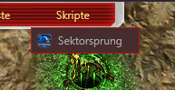
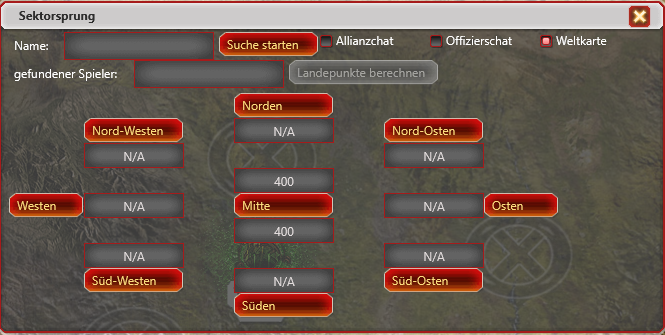

# C&C: Tiberium Alliances – Sektorsprung Harzi Edition


## 🚀 Sektorsprung – Harzi Edition

Das **Sektorsprung-Script – Harzi Edition** erweitert die ursprüngliche
Sektorsprung-Funktion für **C&C: Tiberium Alliances** und stellt die
relevanten Informationen übersichtlich im Spiel dar.

Neben der bisherigen Ausgabe der ermittelten Koordinaten im Chat bietet
diese Version eine wichtige Erweiterung:

> 🌍 Mit aktivierter Checkbox **„Weltkarte“** kann direkt zu den ermittelten
> Koordinaten auf der Weltkarte gesprungen werden.

Damit müssen die Koordinaten nicht mehr aus dem Chat übernommen und anschließend
manuell auf der Weltkarte gesucht werden.

---

## ✨ Funktionen

### 🛰️ Sektorsprung

Das Script unterstützt die Ermittlung und Darstellung der für den
Sektorsprung relevanten Informationen.

Die Informationen werden übersichtlich im Script dargestellt und können
direkt für die weitere Planung verwendet werden.

---

### 🌍 Direkter Sprung zur Weltkarte

Eine der wichtigsten Erweiterungen der **Harzi Edition** ist die neue Option:

**☑ Weltkarte**

Wird die Checkbox **„Weltkarte“** aktiviert, können die ermittelten
Koordinaten direkt auf der Weltkarte angesteuert werden.



Damit entfällt das bisher notwendige manuelle Suchen der Koordinaten.

Bei der älteren Version wurden die ermittelten Koordinaten lediglich im
Chat ausgegeben. Der Spieler musste diese Koordinaten anschließend selbst
auf der Weltkarte suchen.

Mit der **Harzi Edition** kann dieser Schritt bei aktivierter Option
**„Weltkarte“** direkt durchgeführt werden.



---

## 🆚 Unterschied zur bisherigen Version

Die wesentliche Erweiterung gegenüber der ursprünglichen Version ist die
direkte Verbindung zwischen der Koordinatenausgabe und der Weltkarte.

| Funktion | Ursprüngliche Version | Harzi Edition |
|---|:---:|:---:|
| Ermittlung der Koordinaten | ✅ | ✅ |
| Ausgabe der Koordinaten im Chat | ✅ | ✅ |
| Checkbox „Weltkarte“ | ❌ | ✅ |
| Direkter Sprung zu den Koordinaten | ❌ | ✅ |

### Bisher

```text
Sektorsprung
     ↓
Koordinaten werden ermittelt
     ↓
Koordinaten werden im Chat ausgegeben
     ↓
Koordinaten müssen manuell auf der Weltkarte gesucht werden
